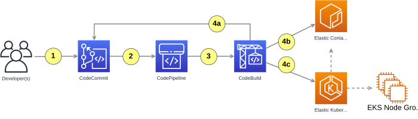
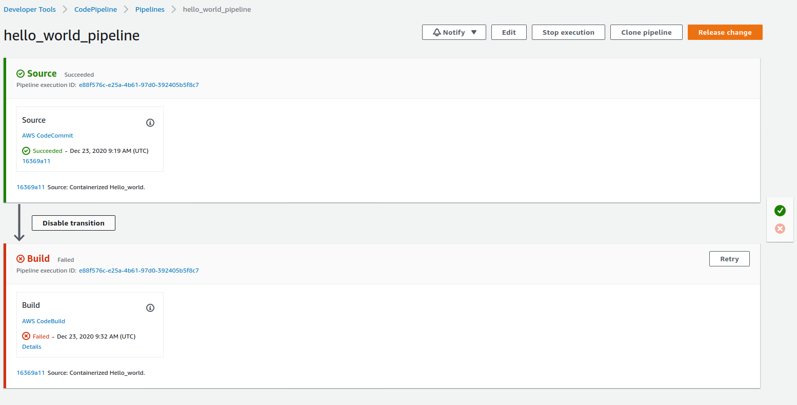
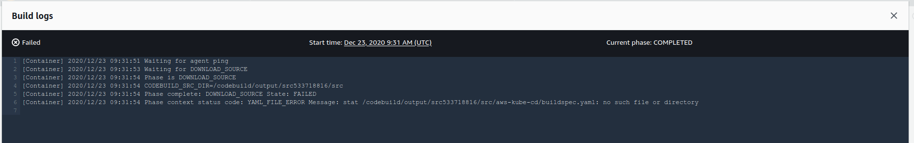

# Continuous Application Deployment with AWS and Kubernetes

This repository includes the source code used to implement continuous application deployment as requested in our Home DevOps Assignment [H DO A](https://127.0.0.1:3737/page/1/ N.B. Sic).
An overview of the proposed solution is illustrated in the figure below.

<p align="center">
</p>

A method to create an end-to-end pipeline which allows us to automatically deploy application to a Kubernetes cluster following a change in the source code.\
The solution described below uses AWS CodeCommit, CodePipeline, Elastic Code Repository (ECR), CodeBuild and Elastic Kubernetes Service (EKS).\
The application I wanted to deploy is a simple “Hello World” web service written in Python Flask.

The final outcome of this tutorial works as follows:

0. You commit (and optionally tag) your code into the git repository on CodeCommit
1. The commit triggers a pipeline to build and deploy code.
2. The pipeline runs a build project on CodeBuild.
3. The build project coordinates tagging (4a), storing (4b) and deployment (4c) of Docker images

# Prerequisites

To run this tutorial we assume basic knowledge of Git, Docker, Kubernetes and Python. You will also need:

- access to an AWS account, and
- a machine with installed: git client and Docker

# Application: Hello World

```
 project:
   Dockerfile
   hello_world.py
   requirements.txt
```

```
❯ docker build -t hello_world_svc .
❯ docker run -p 80:5000 hello_world_svc
```

```
❯ docker run -p 80:5000 hello_world_svc
 * Serving Flask app "hello_world.py"
 * Environment: production
   WARNING: This is a development server. Do not use it in a production deployment.
   Use a production WSGI server instead.
 * Debug mode: off
 * Running on http://0.0.0.0:5000/ (Press CTRL+C to quit)\
172.17.0.1 - - [23/Dec/2020 08:58:10] "GET / HTTP/1.1" 200 -
```

`❯ curl http://127.0.0.1`\
Hello World!

# Code repository on CodeCommit

`❯ git clone https://git-codecommit.eu-west-1.amazonaws.com/v1/repos/hello_world`\
Cloning into 'hello_world'...\
Username for 'https://git-codecommit.eu-west-1.amazonaws.com': bogdan.mutiu-at-xxxxxxxxxxxx\
Password for 'https://bogdan.mutiu-at-xxxxxxxxxxxx@git-codecommit.eu-west-1.amazonaws.com':\
warning: You appear to have cloned an empty repository.

```
git add hello_world.py requirements.txt Dockerfile
git commit -m "Containerized Hello_world."
git push
```

<span style="display:block;text-align:center"></span>

# Continuous deployment pipeline with CodePipeline

<span style="display:block;text-align:center"></span>

<span style="display:block;text-align:center"></span>


# Configuration of the CodeBuild project

buildspec.yaml:

```
version: 0.2
phases:
  pre_build:
    commands:
      - echo Logging in to Amazon ECR...
      - $(aws ecr get-login --no-include-email --region $AWS_DEFAULT_REGION)
  build:
    commands:
      - echo Build started on $(date)
      - echo Building the Docker image...
      - docker build -t $IMAGE_REPO_NAME:$IMAGE_TAG .
      - docker tag $IMAGE_REPO_NAME:$IMAGE_TAG $AWS_ACCOUNT_ID.dkr.ecr.$AWS_DEFAULT_REGION.amazonaws.com/$IMAGE_REPO_NAME:$IMAGE_TAG
  post_build:
    commands:
      - echo Build completed on $(date)
      - echo Pushing the Docker image...
      - docker push $AWS_ACCOUNT_ID.dkr.ecr.$AWS_DEFAULT_REGION.amazonaws.com/$IMAGE_REPO_NAME:$IMAGE_TAG
```

## Accessing the Elastic Container Registry
    Make sure to create the repository in the same AWS region where you created your build project; in the example above it is represented by the AWS_DEFAULT_REGION environment variable.
    Store the repository name in the IMAGE_REPO_NAME environment variable. At the same time set the AWS_ACCOUNT_ID variable.
    Add relevant permissions to the CodeBuild service role we created earlier:
    ...
    {
            "Effect": "Allow",
            "Resource": [
                "arn:aws:s3:::codepipeline-eu-west-1-*",
                "arn:aws:s3:::bmutziu-xxxxxxx-s3storage",
                "arn:aws:s3:::bmutziu-xxxxxxx-s3storage/*"
            ],
            "Action": [
                "s3:PutObject",
                "s3:GetObject",
                "s3:GetObjectVersion",
                "s3:GetBucketAcl",
                "s3:GetBucketLocation"
            ]
    },
    {
            "Effect": "Allow",
            "Action": [
                "ecr:BatchCheckLayerAvailability",
                "ecr:CompleteLayerUpload",
                "ecr:GetAuthorizationToken",
                "ecr:InitiateLayerUpload",
                "ecr:PutImage",
                "ecr:UploadLayerPart"
            ],
            "Resource": "*"
    }
    ...

## Tagging Docker images
    In this exercise, to tag a Docker image, I will use either the tag of the git repository, or if the commit has not been tagged, an abbreviation of the git commit id.\
        In that way we will preserve the link back to the commit of which the image is built whilst, in case the commit was tagged, benefit from meaningful semantic version numbers.\
    Of course the proposed approach will need to be customised if you envisage multiple deployment environments, like development, staging and production, but this is out of scope of this exercise.\
    To summarise, our aim is to find out whether or not our pipeline was triggered by a tagged commit in the code repository and then react accordingly.\
        If the pipeline was triggered by a tagged commit, we want to tag the Docker image using the tag name; note that by convention code is tagged with prefix v, e.g. v1.0.5 whereas Docker images are tagged without the prefix, i.e. 1.0.5\
        Otherwise, we want to tag the Docker image using the git commit id. This will ensure that the latest code changes on the master branch can be safely deployed to the cluster.\

        ...
        TEMP_DIR="$(mktemp -d)"

        git clone "$REPO_URL" "$TEMP_DIR"
        cd "$TEMP_DIR"
        git fetch --tags

        TAG_NAME=$(git tag --points-at "$COMMIT_ID")

        if [[ $TAG_NAME == v* ]]; then
           echo $TAG_NAME | cut -c 2-
        else
           echo $COMMIT_ID | cut -c 1-10
        fi
        ...
```
...
phases:
  build:
    commands:
      ...
      - echo Tagging the new image...
      - IMAGE_BASEID="$AWS_ACCOUNT_ID.dkr.ecr.$AWS_DEFAULT_REGION.amazonaws.com/$IMAGE_REPO_NAME"
      - echo Image base-id = $IMAGE_BASEID
      - chmod u+x ./aws-kube-cd/get-image-tag.sh
      - IMAGE_TAG="$(./aws-kube-cd/get-image-tag.sh $SOURCE_REPO_URL $CODEBUILD_RESOLVED_SOURCE_VERSION)"
      - docker tag $IMAGE_REPO_NAME $IMAGE_BASEID
      - docker tag $IMAGE_REPO_NAME $IMAGE_BASEID:$IMAGE_TAG
  post_build:
    commands:
      ...
      - docker push $IMAGE_BASEID
      - docker push $IMAGE_BASEID:$IMAGE_TAG
...
```

    We added helper variable IMAGE_BASEID to store the root of the Docker image id. Then, we retrieve the image tag from the cloned git repository and store it in the IMAGE_TAG variable.
        However, for the get_image_tag.sh command to work, we have to set environment variable SOURCE_REPO_URL in our CodeBuild project. Simply, set it to the HTTPS clone URL of your hello_world code repository in CodeCommit.
    Next, using the base id and image tag variables we can tag the docker image. The first tag command, docker tag $IMAGE_REPO_NAME $IMAGE_BASEID, tags the Docker image with name latest.
        This is default Docker behaviour if no explicit tag name is given which allows an easy access to the latest version of the docker image.
    The second tag command tags the image using the desired tag name.
    Once tagged we push the image to ECR. The first command will do all the heavy lifting, whilst the second will just mark existing image with an additional alias.
        The effect is that if you annotate your code with tag v1.0 our CodeBuild project will build, tag and push the Docker image to ECR tagged as 1.0
        Otherwise, it will be tagged with the first ten characters of the commit id. Additionally, the image will be available as latest.

    Finally, there are two more little additions needed:

    - allow our CodeBuild role to pull from CodeCommit by adding GitPull permission to the role
```
    {
      "Effect": "Allow",
      "Action": "codecommit:GitPull",
      "Resource": "arn:aws:codecommit:*:*:hello_world"
    }
```
    - enable git-credential-helper in the buildspec.yaml, so that the build environment can clone the repository without the need to pass credentials on the command line
```
    version: 0.2
    env:
      git-credential-helper: yes
```

# Deployment to an EKS cluster
As we want to automatically deploy our hello_world application to an EKS cluster, the final step is to create the cluster and enable our CodeBuild project to deploy the application onto it.

## Creating a cluster and NodeGroup
```
    ❯ terraform plan -out=development.tfplan -var-file=network-development.tfvars -var-file=eks-development.tfvars -var-file=ingress-development.tfvars -var-file=subdomains-development.tfvars -var-file=namespaces-development.tfvars

Refreshing Terraform state in-memory prior to plan...
The refreshed state will be used to calculate this plan, but will not be
persisted to local or remote state storage.

module.eks-cluster.data.aws_partition.current: Refreshing state...
module.eks-cluster.data.aws_ami.eks_worker: Refreshing state...
module.eks-cluster.data.aws_ami.eks_worker_windows: Refreshing state...
data.aws_caller_identity.current: Refreshing state...
data.aws_elb_hosted_zone_id.elb_zone_id: Refreshing state...
module.eks-cluster.data.aws_caller_identity.current: Refreshing state...
data.aws_availability_zones.available_azs: Refreshing state...
module.eks-cluster.data.aws_iam_policy_document.cluster_assume_role_policy: Refreshing state...
data.aws_route53_zone.base_domain: Refreshing state...
data.aws_region.current: Refreshing state...
module.eks-cluster.data.aws_iam_policy_document.workers_assume_role_policy: Refreshing state...

------------------------------------------------------------------------
    ...

aws_route53_record.eks_domain: Creation complete after 35s [id=XXXXXXXXXXXXXXXXXXXXX_bmutziu.me_A]
aws_route53_record.deployments_subdomains["sample"]: Creating...
aws_route53_record.deployments_subdomains["api"]: Creating...
aws_route53_record.deployments_subdomains["api"]: Still creating... [10s elapsed]
aws_route53_record.deployments_subdomains["sample"]: Still creating... [10s elapsed]
aws_route53_record.deployments_subdomains["sample"]: Still creating... [20s elapsed]
aws_route53_record.deployments_subdomains["api"]: Still creating... [20s elapsed]
aws_route53_record.deployments_subdomains["sample"]: Still creating... [30s elapsed]
aws_route53_record.deployments_subdomains["api"]: Still creating... [30s elapsed]
aws_route53_record.deployments_subdomains["api"]: Creation complete after 34s [id=XXXXXXXXXXXXXXXXXXXXX_api.bmutziu.me_CNAME]
aws_route53_record.deployments_subdomains["sample"]: Creation complete after 37s [id=XXXXXXXXXXXXXXXXXXXXX_sample.bmutziu.me_CNAME]

Apply complete! Resources: 75 added, 0 changed, 0 destroyed.
```
```
    ❯ kubectl get svc
NAME                          TYPE           CLUSTER-IP      EXTERNAL-IP                                                               PORT(S)                      AGE
kubernetes                    ClusterIP      172.20.0.1      <none>                                                                    443/TCP                      8m35s

    ❯ kubectl get nodes
NAME                                         STATUS   ROLES    AGE     VERSION
ip-10-50-1-107.eu-west-1.compute.internal    Ready    <none>   5m36s   v1.18.9-eks-d1db3c
ip-10-50-17-1.eu-west-1.compute.internal     Ready    <none>   5m40s   v1.18.9-eks-d1db3c
ip-10-50-39-238.eu-west-1.compute.internal   Ready    <none>   5m37s   v1.18.9-eks-d1db3c
```

## Deploying from localhost
    We would like to deploy an instance of our “Hello World” application and make it publicly available.
        For this to work we will create two descriptors: the application deployment and a load balancer service.
        The load balancer will direct public traffic at the backend application service pods on the worker nodes.

### hello-world-deployment.yaml
```
❯ kubectl apply -f aws-kube-cd/hello-world-deployment-template.yaml
deployment.apps/hello-world-deployment created
```

### hello-world-lbservice.yaml
```
❯ kubectl apply -f aws-kube-cd/hello-world-lbservice.yaml
service/hello-world-svc created
```

```
    ❯ kubectl get deployments
NAME                          READY   UP-TO-DATE   AVAILABLE   AGE
hello-world-deployment        1/1     1            1           5m35s

    ❯ kubectl get svc
NAME                          TYPE           CLUSTER-IP       EXTERNAL-IP                                                               PORT(S)                      AGE
hello-world-svc               LoadBalancer   172.20.102.227   a80c520764f954d87923b813db619647-1175756610.eu-west-1.elb.amazonaws.com   80:31760/TCP                 3m55s
kubernetes                    ClusterIP      172.20.0.1       <none>                                                                    443/TCP                      17m

    ❯ curl http://a80c520764f954d87923b813db619647-1175756610.eu-west-1.elb.amazonaws.com
Hello World!
```

## Integrating deployment into the CodeBuild project

    Up to now our CodePipeline project reacts to changes in the source code, whilst the CodeBuild project builds and pushes a new docker image to ECR.
        It is missing, however, the final deployment step.
    Thus, what we need to focus on is to let the CodeBuild project run kubectl deployment scripts.

    First, we need to run aws eks update-kubeconfig operation to create a Kubernetes configuration file for us.
        Note that every single build of a CodeBuild project is executed on a separate, clean VM instance.

    ❯ aws eks --region $AWS_DEFAULT_REGION update-kubeconfig --name bmutziu-eks

### Configuring aws CLI tool

    It is important to note that CodeBuild instance runs under a role which is dynamically created every time the project is executed.
    We will use account access keys to configure the aws CLI tool, and in this way let the CodeBuild VM get access to the cluster.
```
    ...
    env:
      parameter-store:
        AWS_ACCESS_KEY_ID: "/Test/HelloWorld/access-key-id"
        AWS_SECRET_ACCESS_KEY: "/Test/HelloWorld/access-key-secret"
    ...
```
    Additionally, we need to let the build role access the Parameter Store. Again, find the CodeBuild role associated with our build project in the IAM console.

```
    {
    "Effect": "Allow",
    "Action": "ssm:GetParameters",
    "Resource": "arn:aws:ssm:eu-west-1:xxxxxxxxxxxx>:parameter/Test/HelloWorld/*"
    }

    ❯ aws sts get-caller-identity

    {
    "UserId": "XXXXXXXXXXXXXXXXXXXXX",
    "Account": "xxxxxxxxxxxx",
    "Arn": "arn:aws:iam::xxxxxxxxxxxx:user/bogdan.mutiu"
    }
```

### Using kubectl to deploy the application

    The image id we used in the hello-world-deployment.yaml descriptor referred to IMAGE_BASEID, with no image tag, which implicitly indicates the latest Docker image available.
        Unfortunately, when our deployment is already running and we want to update the Docker image, simple kubectl apply command will not be enough to force Kubernetes to refresh the application pods.
        The descriptor referring to the latest image does not change, and so kubectl assumes that nothing has changed and ignores the apply -f hello-world-deployment.yaml operation.

    We will use a way which can deploy new application, refresh one that is running already and, most of all, keep deployment resilient to multiple parallel changes in the code repository.
        The idea is to set the docker image in the deployment descriptor with explicit id and tag names.

### hello-world-deployment-template.yaml
```
    ...
    image: DOCKER_IMAGE_ID
    ...
```
<pre><b><i>buildspec.yaml</i></b></pre>

```
    - sed s=DOCKER_IMAGE_ID=$IMAGE_BASEID:$IMAGE_TAG= aws-kube-cd/hello-world-deployment-template.yaml | kubectl apply -f -
    - kubectl apply -f aws-kube-cd/hello-world-lbservice.yaml
```

    Since the build project is triggered by a change in the code repository, every time it is run a different IMAGE_TAG is set, and so Kubernetes can notice the change.
        Thus, the apply command either creates a new deployment if it does not exist yet, or updates existing one.
        Additionally, the last line in the buildspec.yaml shows the LoadBalancer public address, which we can use to access our HelloWorld application. All done!

```
    Build completed on Wed Dec 23 14:09:17 UTC 2020


[Container] 2020/12/23 14:09:17 Phase complete: BUILD State: SUCCEEDED


[Container] 2020/12/23 14:09:17 Phase context status code:  Message:


[Container] 2020/12/23 14:09:17 Entering phase POST_BUILD


[Container] 2020/12/23 14:09:17 Running command echo Deployment to your EKS cluster started on $(date)


Deployment to your EKS cluster started on Wed Dec 23 14:09:17 UTC 2020


[Container] 2020/12/23 14:09:17 Running command echo Image id = $IMAGE_BASEID:$IMAGE_TAG


Image id = xxxxxxxxxxxx.dkr.ecr.eu-west-1.amazonaws.com/hello_world_repo:0ce60e5301


[Container] 2020/12/23 14:09:17 Running command aws eks --region $AWS_DEFAULT_REGION update-kubeconfig --name bmutziu-eks


Added new context arn:aws:eks:eu-west-1:xxxxxxxxxxxx:cluster/bmutziu-eks to /root/.kube/config


[Container] 2020/12/23 14:09:17 Running command sed s=DOCKER_IMAGE_ID=$IMAGE_BASEID:$IMAGE_TAG= aws-kube-cd/hello-world-deployment-template.yaml | kubectl apply -f -


deployment.apps/hello-world-deployment configured


[Container] 2020/12/23 14:09:21 Running command kubectl apply -f aws-kube-cd/hello-world-lbservice.yaml


service/hello-world-svc unchanged


[Container] 2020/12/23 14:09:22 Running command echo Deployment completed on $(date)


Deployment completed on Wed Dec 23 14:09:22 UTC 2020


[Container] 2020/12/23 14:09:22 Running command kubectl get svc hello-world-svc


NAME              TYPE           CLUSTER-IP       EXTERNAL-IP                                                               PORT(S)        AGE


hello-world-svc   LoadBalancer   172.20.102.227   a80c520764f954d87923b813db619647-1175756610.eu-west-1.elb.amazonaws.com   80:31760/TCP   46m


[Container] 2020/12/23 14:09:22 Phase complete: POST_BUILD State: SUCCEEDED


[Container] 2020/12/23 14:09:22 Phase context status code:  Message:
```

<pre>
❯ kubectl describe deployment/hello-world-deployment
Name:                   hello-world-deployment
Namespace:              default
CreationTimestamp:      Wed, 23 Dec 2020 15:20:26 +0200
Labels:                 app=hello-world-app
Annotations:            deployment.kubernetes.io/revision: 2
Selector:               app=hello-world-app
Replicas:               1 desired | 1 updated | 1 total | 1 available | 0 unavailable
StrategyType:           RollingUpdate
MinReadySeconds:        0
RollingUpdateStrategy:  25% max unavailable, 25% max surge
Pod Template:
  Labels:  app=hello-world-app
  Containers:
   hello-world-app:
    Image:        xxxxxxxxxxxx.dkr.ecr.eu-west-1.amazonaws.com/hello_world_repo:<b>0ce60e5301</b>
    Port:         5000/TCP
    Host Port:    0/TCP
    Environment:  <none>
    Mounts:       <none>
  Volumes:        <none>
Conditions:
  Type           Status  Reason
  ----           ------  ------
  Available      True    MinimumReplicasAvailable
  Progressing    True    NewReplicaSetAvailable
OldReplicaSets:  <none>
NewReplicaSet:   hello-world-deployment-85fcbbdcff (1/1 replicas created)
Events:
  Type    Reason             Age   From                   Message
  ----    ------             ----  ----                   -------
  Normal  ScalingReplicaSet  22m   deployment-controller  Scaled up replica set hello-world-deployment-85fcbbdcff to 1
  Normal  ScalingReplicaSet  21m   deployment-controller  Scaled down replica set hello-world-deployment-c5cf7cf97 to 0


    ❯ curl http://a80c520764f954d87923b813db619647-1175756610.eu-west-1.elb.amazonaws.com
Hello World!
</pre>

<span style="display:block;text-align:center"></span>

# Summary

In this post I presented an end-to-end example of continuous deployment of a simple Web application to a Kubernetes cluster running in an Amazon EKS cluster.\
Every time you commit and push a change to the source code repository a new Docker image is build and deployed in the cluster.

```
git commit -m "Some change in the source code."
git push
```

Moreover, if you tag a change before pushing, the Docker image will be tagged accordingly

```
git commit -m "Some other change in the source code."
git tag v1.0.2
git push --tags
git push
```
<pre>
❯ kubectl describe deployment/hello-world-deployment
Name:                   hello-world-deployment
Namespace:              default
CreationTimestamp:      Wed, 23 Dec 2020 15:20:26 +0200
Labels:                 app=hello-world-app
Annotations:            deployment.kubernetes.io/revision: 3
Selector:               app=hello-world-app
Replicas:               1 desired | 1 updated | 1 total | 1 available | 0 unavailable
StrategyType:           RollingUpdate
MinReadySeconds:        0
RollingUpdateStrategy:  25% max unavailable, 25% max surge
Pod Template:
  Labels:  app=hello-world-app
  Containers:
   hello-world-app:
    Image:        xxxxxxxxxxxx.dkr.ecr.eu-west-1.amazonaws.com/hello_world_repo:<b>1.0.2</b>
    Port:         5000/TCP
    Host Port:    0/TCP
    Environment:  <none>
    Mounts:       <none>
  Volumes:        <none>
Conditions:
  Type           Status  Reason
  ----           ------  ------
  Available      True    MinimumReplicasAvailable
  Progressing    True    NewReplicaSetAvailable
OldReplicaSets:  <none>
NewReplicaSet:   hello-world-deployment-54c9bd584b (1/1 replicas created)
Events:
  Type    Reason             Age   From                   Message
  ----    ------             ----  ----                   -------
  Normal  ScalingReplicaSet  32m   deployment-controller  Scaled up replica set hello-world-deployment-85fcbbdcff to 1
  Normal  ScalingReplicaSet  31m   deployment-controller  Scaled down replica set hello-world-deployment-c5cf7cf97 to 0
  Normal  ScalingReplicaSet  3m5s  deployment-controller  Scaled up replica set hello-world-deployment-54c9bd584b to 1
  Normal  ScalingReplicaSet  3m3s  deployment-controller  Scaled down replica set hello-world-deployment-85fcbbdcff to 0

❯ curl http://a80c520764f954d87923b813db619647-1175756610.eu-west-1.elb.amazonaws.com
Hello World!
</pre>

<span style="display:block;text-align:center"></span>
<span style="display:block;text-align:center"></span>

Contrary to other solutions which you can find online, this one does not use any extra VMs, containers or Lambda functions to complete the deployment.\
    &nbsp;&nbsp;&nbsp;&nbsp;It simply re-uses a CodeBuild instance to complete all the steps.\
Of particular interest might be the way we tag Docker images and use the tag to change the Kubernetes deployment descriptor.\
    &nbsp;&nbsp;&nbsp;&nbsp;Therefore, this solution can deploy a new application as well as update one already running.\
Additionally, reading the tag of the git source code repository makes it relatively straightforward to adapt our CodeBuild project to handle multiple deployment environments like testing, staging and production.

<span style="display:block;text-align:center"></span>
